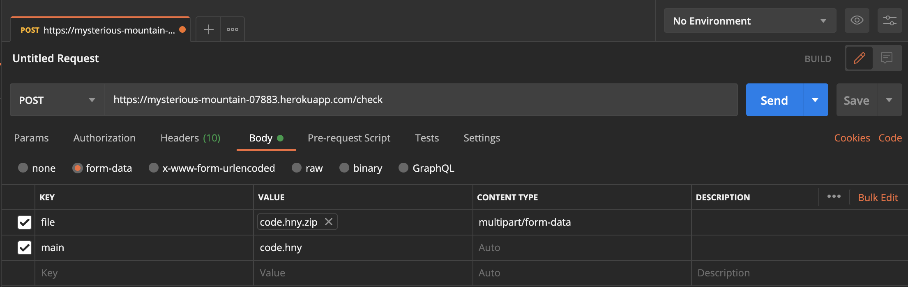

# HarmonyLang-Server

A server that hosts the (C)Harmony compiler implemented in C, a successor to the Harmony compiler implemented in Python.

## Development Setup

Make sure you have Node installed. Clone the repository and run `yarn install` (or `npm install`).

You can then start the server by running `yarn dev` (or `npm run dev`).

## Making Requests

The server is deployed via Heroku on https://mysterious-mountain-07883.herokuapp.com/. Alternatively, the server can be deployed locally using the instructions in the above section. 

The server exposes one API endpoint `POST /check`, which accepts form-data containing a zip file of the Harmony files, and the name to the start of the Harmony program.

The `FormData` contains two fields: `file` and `main`. The value of `file` is a read stream of a zip file that contains the Harmony files. The value of `main` is the filepath name to the starting Harmony file, relative to the root of the zipped content.

An example of a request made via Postman:

When the request is successful, the response contains a JSON body with the status value for the request, and another related value.

The `status` value may be one of `SUCCESS`, `FAILURE`, or `ERROR`.

If the `status` value is `SUCCESS`, the model check was successful and no issues were found. If the status value is `ERROR`, then an error occurred while running the model checker. For these two statuses, the response body contains a `message` that gives more details about those statuses.

If the status value is `FAILURE`, then the model checker caught a failed invariant in the Harmony program, which could include a failed assertion or deadlock.
A response body with this `status` contains a `jsonBody` value, which is the contents of the `charm.json` file produced by the (C)Harmony compiler.
This `jsonBody` can then be used for further analysis in some other application.
